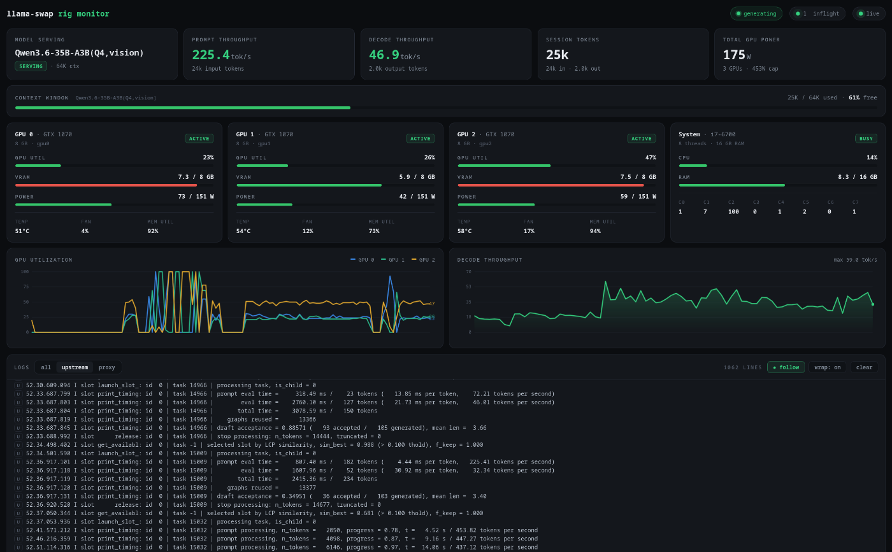

# llama-swap rig monitor

A single-page, real-time monitoring dashboard for a [llama-swap](https://github.com/mostlygeek/llama-swap) server. It shows the running model, live token throughput, context-window usage, per-GPU and system resources, and a streaming log viewer — all in one screen with a dark terminal aesthetic.



<!-- Drop a screenshot at docs/screenshot.png if you want the image above to render. -->

## What it shows

- **Model serving** — the currently loaded model, its state (serving / loading / idle), and configured context size.
- **Prompt / decode throughput** — live tokens/sec while a request is generating; `0` when idle.
- **Session tokens** — input + output of the current request (tracks the live conversation; resets when the client clears context).
- **Context window** — a color-coded bar of current KV occupancy vs the model's `--ctx-size` (green → yellow at 60% → red at 80%), with percent free.
- **Per-GPU cards** — utilization, VRAM, power (same 60/80% thresholds), plus temp / fan / memory-util.
- **System card** — CPU (per-core) and RAM.
- **Charts** — rolling GPU-utilization (per card) and decode-throughput history.
- **Live logs** — streamed proxy/upstream logs with level coloring, source filter, wrap toggle, and a **follow** button that pins to the newest lines.
- A **generating…** indicator that pulses while a request is in flight.

Values update live *during* generation — including while a model is "thinking" — by reading the llama-server slot state directly.

## How it works

The whole UI is one self-contained `index.html` (vanilla JS/CSS, no build step, no dependencies). It pulls data from llama-swap:

| Data | Source |
|------|--------|
| Model state, request metrics, streaming logs, in-flight count | `GET /api/events` (SSE) |
| GPU + CPU/RAM stats | `GET /api/performance` (polled every 5s) |
| Running model + `--ctx-size` | `GET /running` |
| Live per-token counts during generation | the llama-server `/slots` endpoint, read **directly** (see below) |

Because llama-swap does **not** send CORS headers on its responses, a browser can't fetch it cross-origin. So `serve.py` — a ~130-line, pure-stdlib helper — serves the page and transparently proxies API calls to llama-swap on the **same origin**. It has no dependencies, no state, and no configuration files.

### Why `/slots` is read directly (swap-safety)

Live token counts come from the llama-server `/slots` endpoint. It is **not** read through llama-swap's `/upstream/{model}/…` route, because that route runs the request through llama-swap's model router and will **load/swap to the targeted model if it isn't already running** — a monitor polling it could ping-pong models against your real workload. Instead, `serve.py` exposes `GET /_slots`, which reads the loaded llama-server **directly on `127.0.0.1:8081`**, bypassing the swap logic entirely. During a model load it returns `503` and the UI falls back to the last completed request's numbers. Polling it can never trigger a swap.

## Requirements

- A running **llama-swap** with the `/api/performance` and `/api/events` endpoints (v224 or newer).
- GPU stats come from llama-swap's performance monitor (nvidia-smi / LACT / rocm-smi) — nothing to install here.
- **Python 3** (standard library only — no `pip install`).
- The llama-server upstream on `127.0.0.1:8081` (llama-swap's default). If yours differs, change `UPSTREAM_LLAMA` in `serve.py`.

## Install

```bash
git clone <this-repo> ~/dashboard
cd ~/dashboard
```

### Run it directly

```bash
python3 serve.py            # serves on 0.0.0.0:8090, proxying llama-swap at 127.0.0.1:8080
python3 serve.py --port 9000 --host 127.0.0.1
```

Then open `http://<rig-ip>:8090/`.

### Run it as a service (systemd, always-on)

A user unit is included. Edit the paths in `llama-dashboard.service` if you didn't clone to `~/dashboard`, then:

```bash
mkdir -p ~/.config/systemd/user
cp llama-dashboard.service ~/.config/systemd/user/
systemctl --user daemon-reload
systemctl --user enable --now llama-dashboard.service

# survive logout / run at boot without an active login session:
loginctl enable-linger "$USER"
```

Check it: `systemctl --user status llama-dashboard` · logs: `journalctl --user -u llama-dashboard -f`.

## Configuration

Everything is a small edit near the top of the two files:

- **Ports / hosts** — `serve.py`: `--port` / `--host` flags; `UPSTREAM` (llama-swap, `:8080`) and `UPSTREAM_LLAMA` (llama-server, `:8081`) constants.
- **Rig name in the title** — the page/tab title reads `<name> monitor`, where `<name>` defaults to the machine's **hostname**. Set the `RIG_NAME` environment variable to override it (e.g. `RIG_NAME=gpubox python3 serve.py`, or uncomment the `Environment=` line in the systemd unit).
- **Bar thresholds** — `index.html`: GPU/system meters use `loadColor(pct, 60, 80)`; the context bar switches at 60% / 80%. Adjust to taste.
- **Poll intervals / history depth** — `index.html` top of `<script>`: `PERF_MS` (perf poll), `HIST` (util history points), `DEC_HIST`, `LOG_CAP`, and the `/slots` interval in `onInflight`.
- **Power bar scale** — `POWER_MAX` (per-GPU TDP in watts).

## Notes

- No authentication — it binds to `0.0.0.0` like llama-swap itself. Fine for a trusted LAN; **don't expose the port to the internet.**
- llama-swap swaps are always **request-driven**: it only loads a different model when a client asks for one. If you see frequent swapping, it's your client requesting multiple models (e.g. a main model plus a separate small/title model) — not this dashboard, which is swap-safe by design.
- `serve.py` streams the SSE log/event feed unbuffered so logs appear in real time.

## Files

- `index.html` — the entire dashboard (UI + all logic).
- `serve.py` — same-origin static server + swap-safe API proxy.
- `llama-dashboard.service` — systemd user unit.
